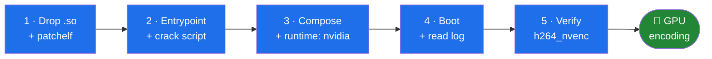

# 🎬 plexmediaserver_crack (updated fork)

> *Plex Pass features without the Plex Pass bill.*


-blue)


A maintained fork of [`yuv420p10le/plexmediaserver_crack`](https://gitgud.io/yuv420p10le/plexmediaserver_crack)
/ the [`gmh5225` GitHub mirror](https://github.com/gmh5225/plexmediaserver_crack),
with setup instructions, build tooling, and notes from trying to crack the newer
Plex builds.

The crack is a preload library (`plexmediaserver_crack.so`) patched into Plex
Media Server's `libsoci_core.so` so that Plex's feature-entitlement check always
returns `true` — enabling Plex Pass features (hardware transcoding, etc.) on a
server whose account does not have a Plex Pass.

[**📊 Compatibility matrix**](COMPATIBILITY.md) · [**🤝 Contributing**](CONTRIBUTING.md) · [**💬 Discussions**](https://github.com/bpawnzZ/plexmediaserver-crack/discussions) · [**🐛 Report a setup**](https://github.com/bpawnzZ/plexmediaserver-crack/issues/new?template=hardware-report.yml)

> [!WARNING]
> **Read this before you start.** This crack works on **Plex 1.43.0**. It does
> **not** work on 1.43.4 — see [Cracking the newer builds](#-cracking-the-newer-builds)
> for what was tried and where it stands. If you are on 1.43.4 and hardware
> transcoding matters to you, **pin to 1.43.0**.

---

## 🤖 Hand this to your agent

Paste the block below into your coding agent (Claude Code, Codex, Cursor, …).
The prompt is self-contained: it carries the pinned version, the gotchas that
silently produce an unpatched server, and a definition of done. Fill in the two
paths first.

Working **on this repo** rather than setting it up? Point your agent at
[`AGENTS.md`](AGENTS.md) instead — it has the build and verify commands, the
constraints, and the list of dead ends not to re-investigate.

````text
Set up plexmediaserver_crack for my Plex Media Server in Docker.

MY CONTEXT
- Compose file / deploy dir: <absolute path, e.g. /home/me/docker/plex-crypt>
- Media libraries: <absolute path(s) to bind-mount, e.g. /mnt/media>
- Crack source: this repo, at <absolute path to this repo>

HARD CONSTRAINTS — do not deviate
- Pin Plex to 1.43.0.10492-121068a07-ls297. Do NOT use `latest` and do NOT bump
  the tag: 1.43.4 breaks NVIDIA hardware transcoding independently of the crack.
- `VERSION=` must equal the pinned version string. Never `VERSION=docker` — that
  self-updates Plex on boot and silently walks past the pinned tag.
- The crack library is built against musl. A glibc build will not load into
  Plex's musl process. Verify with `readelf -d` before shipping it.
- `runtime: nvidia` is required (not `deploy.resources`), so /dev/dri/renderD128
  is exposed. Without it NVENC fails.

WHAT TO DO
1. Read the README's Quick start (steps 1-5) and docs/FINDINGS.md in full first.
2. Lay out the config dir: `plexmediaserver_crack.so` + `patchelf` inside it.
   Build the .so if I don't already have one — `make` handles the musl build.
3. Copy `examples/plex-entrypoint.sh` and `scripts/crack_plex.sh` next to my
   compose file; chmod +x both.
4. Write/update my compose file with: the pinned image, `runtime: nvidia`,
   `entrypoint: /plex-entrypoint.sh`, `.:/host-docker:ro`, and `./plex:/config`.
   Preserve my existing volume mounts and PUID/PGID/TZ; only add what is missing.
5. `docker compose up -d` and read `docker compose logs plex`. Confirm the log
   shows the driver libs linked AND "✅ Crack applied inside container".
6. Verify for real: trigger a transcode, then read Plex's decision from its log.
   Do NOT test by running `Plex Transcoder` directly — it succeeds even on broken
   builds and gives a false positive.

DEFINITION OF DONE — all three, with the raw output pasted back to me
a. `docker exec plex /config/patchelf --print-needed \
      /usr/lib/plexmediaserver/lib/libsoci_core.so` lists plexmediaserver_crack.so
b. Plex Media Server log shows `Used slots for 10de:<pci-id> ... is now 1`
   (GPU slot, not `Used slots for CPU`)
c. Plex Media Server log shows `encoder=h264_nvenc` (not `encoder=libx264`)

REPORTING
- A running container is NOT proof the crack applied. If any check in (a)-(c)
  fails, say so explicitly and paste the failing output — do not report success.
- Tell me every file you created or changed, and the exact commands you ran.
- If the crack silently no-ops, re-run with `PLEXCRACK_DEBUG=1` and report what
  `[crack] is_feature_available = ...` printed. If it is 0, the signature scan
  missed and the hook was not applied.
````

---

## 🚀 Quick start

**Five steps. Ten minutes. One successful transcode.**



### 📦 1. Get the library

You need two files in your Plex config directory:

- `plexmediaserver_crack.so` — the crack library
- `patchelf` — used to link it in at boot

**Option A — use a prebuilt `.so`.** If you already have a working
`plexmediaserver_crack.so`, drop it into the config directory next to Plex's own
files. Keep it, and take a hash so you know what you are running:

```sh
md5sum plex/plexmediaserver_crack.so
```

**Option B — build it.** See [Building the library](#-building-the-library).
Then copy the output, plus `patchelf`, into the config directory:

```sh
cp plexmediaserver_crack.so plex/
cp "$(command -v patchelf)" plex/
```

Either way the config directory must end up looking like:

```
plex/                              # your Plex config dir, mounted at /config
├── plexmediaserver_crack.so
├── patchelf
└── Library/ ...                   # normal Plex config, untouched
```

### 🪝 2. Take the entrypoint

Copy [`examples/plex-entrypoint.sh`](examples/plex-entrypoint.sh) next to your
compose file:

```sh
cp examples/plex-entrypoint.sh .
chmod +x plex-entrypoint.sh
```

It does two jobs, in order:

1. **Copies the NVIDIA driver libraries** from `/lib` into
   `/usr/lib/plexmediaserver/lib/`, where `Plex Transcoder` actually looks for
   them (it uses its own `rpath`, not the system linker path). Without this,
   NVENC fails with `Cannot load libcuda.so.1` and Plex silently falls back to
   software transcoding.
2. **Runs `crack_plex.sh`**, which:
   - symlinks `/config/plexmediaserver_crack.so` next to `libsoci_core.so` and
     prepends it to that library's `DT_NEEDED` list with `/config/patchelf`,
   - backs up `Preferences.xml`, then forces `TranscoderHardwareAccelerated="1"`
     and `EnableHardwareEncoding="1"` into it (creating either attribute if it is
     missing),
   - verifies the patch took by reading `DT_NEEDED` back and grepping for the
     library.

   The config edits happen automatically. The `Preferences.xml` backup is written
   next to the original with a timestamp suffix.

Then it `exec`s `/init` to start Plex.

Copy the crack script alongside it:

```sh
cp scripts/crack_plex.sh .
```

### 🧩 3. Add it to docker-compose

The three things that matter: the `nvidia` runtime, the entrypoint, and the
mounts the entrypoint needs. Starting from
[`examples/docker-compose.yml`](examples/docker-compose.yml):

```yaml
services:
  plex:
    image: linuxserver/plex:1.43.0.10492-121068a07-ls297   # see the pin below
    container_name: plex
    restart: unless-stopped
    network_mode: host

    runtime: nvidia                                       # exposes /dev/nvidia*, renderD128

    environment:
      - PUID=1000
      - PGID=1000
      - TZ=Etc/UTC
      - NVIDIA_VISIBLE_DEVICES=all
      - NVIDIA_DRIVER_CAPABILITIES=all
      - VERSION=docker                                    # see the pin below
      # - PLEXCRACK_DEBUG=1                               # uncomment to log the sig scan

    volumes:
      - /path/to/media:/media
      - ./plex:/config                                  # holds the .so + patchelf
      - ./transcodes:/transcode
      - /etc/localtime:/etc/localtime:ro
      - ./plex-entrypoint.sh:/plex-entrypoint.sh:ro     # the entrypoint
      - .:/host-docker:ro                               # so crack_plex.sh is reachable

    entrypoint: /plex-entrypoint.sh
```

Two details that are easy to get wrong:

- **The `.so` and `patchelf` must be inside the mounted config dir** (`./plex`),
  because that is where `crack_plex.sh` expects to find them.
- **`.:/host-docker:ro` must be mounted**, because the entrypoint runs
  `/host-docker/crack_plex.sh`. If that mount is missing, the entrypoint logs
  `ERROR: crack_plex.sh not found` and starts Plex without the crack.

### 🔥 4. Start it and check the log

```sh
docker compose up -d
docker compose logs -f plex
```

On a good boot you should see the driver libraries being copied:

```
=== Linking NVIDIA driver libs into Plex transcoder lib dir ===
Linked libcuda.so.1
Linked libnvidia-encode.so.1
Linked libnvcuvid.so.1
```

then the crack running and reporting success:

```
=== Running Plex Crack Script ===
Found crack_plex.sh at /host-docker/crack_plex.sh
Executing crack script...
🔧 Plex Media Server Crack Automation Script
==========================================
⚠️  Running inside container as root
📦 Running inside Plex container...
🔧 Applying crack...
✅ Crack applied inside container
```

Failure modes to look for:

| Log line | Meaning |
|---|---|
| `ERROR: crack_plex.sh not found` | the `.:/host-docker:ro` mount is missing |
| `❌ Crack library not found at /config/plexmediaserver_crack.so` | step 1 not done |
| `❌ patchelf not found at /config/patchelf` | step 1, `patchelf` half not done |
| *(nothing at all about the crack)* | the `entrypoint:` is not set, so it never ran |

Note that none of these stop Plex from starting — the entrypoint does not check
the script's exit status, so a failed crack still ends in a running, **unpatched**
server. Always confirm with the transcode-log check in step 5, not just by seeing
the container up.

If the crack did not apply, there is usually **no error at all** — the library
fails its signature scan silently and Plex just runs unpatched. Turn on
`PLEXCRACK_DEBUG=1` to see why:

```
PLEXCRACK_DEBUG=1 docker compose up -d && docker compose logs plex | grep '\[crack\]'
```

```
[crack] .text = 0x... - 0x...
[crack] is_feature_available = 0x...
```

`is_feature_available = 0` means the signature did not match (or matched more
than once) and the hook was **not** applied.

### ✅ 5. Confirm hardware transcoding actually works

**Do not test by running `Plex Transcoder` directly.** A direct invocation

```sh
Plex Transcoder -hwaccel nvdec -i in.mp4 -c:v h264_nvenc -f null -
```

**succeeds on every version**, including ones where hardware transcoding is
broken end-to-end. It bypasses Plex Media Server's transcode-decision engine,
which is where things actually fail. This produces a false positive.

The valid test is to let Plex Media Server itself pick the encoder, then read its
decision. Start any transcode (play something from a browser at a quality below
the source), then:

```sh
docker exec plex grep -E "Used slots for|encoder=" \
  "/config/Library/Application Support/Plex Media Server/Logs/Plex Media Server.log" | tail -3
```

| What you see | Meaning |
|---|---|
| `Used slots for 10de:<pci-id> …is now 1` | GPU slot registered — hardware path |
| `Used slots for CPU is now 1` | software slot — hardware path **not** taken |
| `encoder=h264_nvenc` | hardware encode selected ✅ |
| `encoder=libx264` | software encode selected ❌ |

**Working looks like this:**

```
Used slots for 10de:1be1:1043:13f0@0000:01:00.0is now 1
Reached Decision ... encoder=h264_nvenc ...
```

You can also force a session without a client, using the server's own token
(`PlexOnlineToken` in `Preferences.xml`):

```sh
TOKEN=$(docker exec plex grep -oP 'PlexOnlineToken="\K[^"]+' \
  "/config/Library/Application Support/Plex Media Server/Preferences.xml")

docker exec plex curl -s -o /dev/null -H "X-Plex-Token: $TOKEN" \
  "http://127.0.0.1:32400/video/:/transcode/universal/start.m3u8?path=%2Flibrary%2Fmetadata%2F<ratingKey>&mediaIndex=0&partIndex=0&protocol=hls&directPlay=0&directStream=1&videoResolution=1280x720&maxVideoBitrate=4000&session=test&X-Plex-Platform=Chrome&X-Plex-Client-Identifier=test"
```

(replace `<ratingKey>` with any item id from `/library/sections/<n>/all`), wait a
few seconds, then run the grep above.

---

## 🌍 Remote access without a Plex Pass

Plex's own remote access needs a Plex Pass (or the rate-limited relay). You do
not need either. Put the server and your clients on a private VPN mesh and reach
it at its mesh IP — **no port forward, nothing exposed to the internet.**

This works well *because* of the crack, not in spite of it: hardware encoding
keeps the stream small. A 1080p NVENC stream is roughly 4–8 Mbit/s, which any VPN
tunnel carries comfortably — where direct-playing a 40 Mbit/s remux would not.
That headroom is the difference between one remote stream and several.

### Pick your mesh: ZeroTier or WireGuard

Both work, and after the DNS point below they are **effectively equivalent**.
The mesh only determines how packets get to the server; it does not change what
the server does with them.

| | ZeroTier / Tailscale | Plain WireGuard |
|---|---|---|
| Reach the server at its mesh IP | ✅ | ✅ |
| Remote playback without a Pass | ✅ | ✅ *(needs the DNS layer below)* |
| Setup effort | join network, authorise | configure hub + per-client keys |

What people actually trip over is not the mesh choice — it is **DNS**, which is
the next section and the one worth reading even if you never touch WireGuard.

### The DNS layer is what makes it work

This is the part that is easy to miss, and the reason a mesh can look broken
when it is fine.

**Run your own DNS, and make sure it can resolve and reach hosts on whichever
VPN network you chose.** That resolver is what turns "reachable by IP" into
"reachable by name", and it is the layer that ties your mesh together. The
server reaches a client by name resolving to a mesh address, and a client
reaches the server the same way. Get this right and either mesh works; get it
wrong and you will blame the VPN.

In this deployment the resolver is **self-hosted** (pihole, inside a container),
and it answers on the mesh. It happens to sit on two networks here, but one is
enough — the requirement is only that the resolver is reachable from the network
you actually use. Two properties matter:

- **It answers on your VPN network.** Any host on the mesh can query it and get
  mesh addresses back.
- **DNS traffic stays on the internal path.** Queries go to the resolver over the
  VPN only — no lookup leaves for the public internet, so nothing is exposed and
  there is nothing to leak. (There is a DoH resolver running too, but the clients
  never touch it directly: they talk to the internal resolver, and that resolver
  is what talks outward.)

An address on one mesh is reachable **only over that mesh**, so if you do run
several, the resolver has to be reachable from each and the router between them
has to forward. Where two meshes meet, that forwarding is explicit:

```sh
# each mesh is a separate interface, and forwarding between them is allowed
ufw route allow in  on wg0     # wg0 <-> anywhere
ufw route allow out on wg0
```

With `DEFAULT_FORWARD_POLICY="DROP"` those rules are what let a client on one
mesh reach a resolver on the other. Remove them and DNS breaks silently while
the tunnel still looks healthy.

**The failure mode is deceptive**, which is why this wastes evenings: a
ZeroTier-only address works perfectly from any host that happens to be on
ZeroTier, so testing from the wrong machine makes a broken config look correct.

Two real failures, one box:

1. **`PEERDNS=<zerotier-ip>` in the WireGuard hub.** The phone had no route to
   the resolver, so *every* DNS lookup failed and the device looked like it had
   no internet at all. The tunnel itself was fine.
2. **`/etc/docker/daemon.json` pinned `"dns": ["<zerotier-ip>"]`** for every
   container on the host. When that mesh is down, **name resolution inside every
   container dies with it.** Plex is unaffected (it talks to IPs), but anything
   that resolves a hostname is not.

The fix is ordering, not removal — list resolvers so at least one is always
reachable:

```json
{ "dns": ["<mesh-resolver-ip>", "<other-resolver-ip>"] }
```

Ordering is a real trade, so choose deliberately:

- **Internal resolver first** — the intended setup: everything resolves through
  the self-hosted resolver on the mesh, with filtering intact.
- **A public/secondary resolver second** — a safety net, at the cost of
  occasionally resolving outside your own DNS.

Two gotchas when you apply it:

- **`systemctl reload docker` does not apply a `dns` change.** dockerd logs
  `Reloaded configuration` while its *effective* config still lists the old
  servers. You need a full `systemctl restart docker`. Containers with a
  restart policy (`always` / `unless-stopped`) come back on their own.
- **Verify from inside a container**, not from the host — they are different
  network namespaces:

  ```sh
  docker exec plex cat /etc/resolv.conf   # your new server must be listed
  ```

### Why ZeroTier can *appear* to work without this

Historically this section claimed WireGuard could not do remote access. That was
wrong, and the correction is worth recording because the confusion is easy to
repeat.

ZeroTier has an incidental advantage: the kernel routes its address via **`dev
lo`**, so Plex sees those requests as **loopback** — and loopback is
unconditionally local. WireGuard traffic arrives on `wg0` from a subnet Plex does
not enumerate, so it is classified remote and, with no public port forward,
falls back to **Plex Relay** — which is a **Plex Pass feature**. That is where
the Pass prompt comes from.

But this is a Plex-classification quirk, not a mesh capability. **Once DNS is
correct, both meshes behave the same** for reaching the server and playing back
over it. Do not choose a mesh expecting ZeroTier to hand you something WireGuard
cannot; fix DNS instead.

### ZeroTier setup — verified on this server

Server side, after joining your network in
[ZeroTier Central](https://my.zerotier.com/) and authorising the node:

```sh
sudo zerotier-cli listnetworks
# 200 listnetworks <nwid> <name> <mac> OK PRIVATE <iface> <mesh-ip>/16
```

That is the whole setup. There is nothing to configure for Plex — with
`network_mode: host` the server already listens on every interface, so the mesh
IP answers immediately:

```sh
curl -s "http://<mesh-ip>:32400/identity"
# <MediaContainer ... version="1.43.0.10492-121068a07"></MediaContainer>
```

Both halves of the pipeline work over the mesh: the server hardware-encodes
(`encoder=h264_nvenc`, per the check in step 5) and the client decodes the stream
normally. Streaming, transcoding and remote playback all behave the same as they
do on the LAN.

Then, from any device on the same network, open
`http://<mesh-ip>:32400/web`. In the Plex apps, add it as a manual connection
(`<mesh-ip>:32400`) — signing in with the same Plex account usually
auto-discovers it, but a manual connection is deterministic and does not depend
on Plex's own discovery services.

**Installing the mesh client on the viewing device is required**, phones and TVs
included. A browser on a friend's laptop that has not joined the network cannot
reach `<mesh-ip>` — which is the point.

### What actually has to be in place

| Requirement | Why | Where to set it |
|---|---|---|
| Node joined **and authorised** | an unauthorised node gets an interface but no route | ZeroTier Central → Members |
| `allowManaged=1` | lets ZeroTier assign the mesh address | `networks.d/<nwid>.local.conf` |
| `allowGlobal=0`, `allowDefault=0` | keeps ZeroTier out of your default route and global traffic — mesh only | same file |
| Firewall permits the mesh interface | UFW's default is deny-incoming | `ufw allow in on <iface>` |
| `network_mode: host` in compose | otherwise `32400` is only reachable inside the container's own netns | compose file |

`allowGlobal=0` and `allowDefault=0` are why this "just works" without touching
any routing: ZeroTier adds its own mesh route and interface, and nothing else.
Leave them off.

### Other gotchas

- **Plex's "Remote Access" page will still say unavailable.** It tests the
  public-internet path via a port forward or Plex's relay, neither of which you
  are using. The red indicator is expected and means nothing here. Do not go
  chasing it with a manual port mapping or by enabling the relay.
- **ZeroTier's own DNS management is inert on a host without systemd-resolved.**
  It drives `systemd-resolved`, which is not installed on every host, so
  `allowDNS=1` does nothing there and the network advertises no resolver. On such
  a host `/etc/resolv.conf` is a plain static file, not a symlink.
- **Bitrate still matters.** Remote playback that needs more than your tunnel
  sustains will buffer. Cap the remote quality in the client rather than blaming
  the GPU — check the `encoder=` line first to confirm the transcode is on the
  hardware path at all.

### Plex settings that do *not* control any of this

Chasing the Pass prompt through Plex preferences wastes time. Measured, on a
signed-in server:

| Setting | Reality |
|---|---|
| `LanNetworksBandwidth` | **Bandwidth policy, not the local/remote verdict.** Setting it changes nothing about reachability. |
| `customConnections` | Publishes a URI to plex.tv, but the client still does not prefer it. |
| `allowedNetworks` | **Must stay empty.** It grants access **without login**, and only applies when the server is signed *out*. Filling it with a mesh subnet opens **unauthenticated** access to anything on the mesh. |
| `secureConnections` | `1` means **Preferred** — Plex's enum is inverted (`1:Preferred\|0:Required`). Do not "fix" it to `0`; that is the *stricter* setting and breaks plain-HTTP mesh clients. |

### Debug order: network first, preferences never

1. **Can the client reach the server at its tunnel IP?**

   ```sh
   curl http://<tunnel-ip>:32400/identity
   ```

   If that answers, **the network is fine** — the problem is classification, and
   no amount of Plex preference editing fixes classification.
2. **Is the client's mesh interface up, and is the handshake current?**

   ```sh
   sudo wg show          # WireGuard
   sudo zerotier-cli listnetworks   # ZeroTier
   ```

3. **Does the client resolve names at all?** If not, you have walked into the
   DNS trap above.

---

## 📌 Pin your version

Both of these must be pinned, or the version you tested is not the version you
run:

- **`image:`** — pin the tag (`linuxserver/plex:1.43.0.10492-121068a07-ls297`),
  not `latest`.
- **`VERSION=`** — set it to the same version. The value `docker` makes Plex
  **self-update on boot**, which silently walks you past your pinned tag and on
  to whatever is newest. Your pin then means nothing.

---

## 🔨 Building the library

The Plex Media Server process is a **musl** binary, so the crack must be built
against musl (Alpine). A host glibc build produces a `.so` that will not load
into the target process.

```sh
make                       # builds via the Alpine container, then verifies the linkage
```

or directly:

```sh
docker build -f docker/Dockerfile.build -o . .
```

Under the hood it is a single `g++` call, statically linking the C++ runtime so
the result depends only on `libc.musl-x86_64.so.1`:

```sh
g++ -shared -fPIC -O2 -std=c++17 -static-libstdc++ -static-libgcc \
    -o plexmediaserver_crack.so main.cpp hook.cpp -lrt
```

Always verify the result:

```sh
readelf -d plexmediaserver_crack.so | grep NEEDED
# must list libc.musl-x86_64.so.1, NOT libc.so.6
```

---

## 🧠 How the crack works

`plexmediaserver_crack.so` gets loaded into the `Plex Media Server` process
because it is added to the `DT_NEEDED` list of `libsoci_core.so`, which the
server always loads.

At load time its constructor runs `hook()`:

1. `get_dottext_info()` reads `/proc/self/maps` and finds the executable
   (`.text`) range of `Plex Media Server`.
2. `sig_scan()` does an AOB (array-of-bytes) scan of that range for a byte
   signature identifying the target function.
3. The first bytes of the target function are overwritten with a stub that
   `ret`s into `hook_is_feature_available()`:

   ```asm
   mov rax, <address of hook_is_feature_available>
   push rax
   ret
   ```

4. `hook_is_feature_available()` returns `true`, so every feature lookup
   succeeds.

### Why the last signature byte is a wildcard

Upstream's signature ended `... 48 8D 7B 30`, i.e. `lea rdi,[rbx+0x30]`. That
last byte is a **struct-member displacement**, and it drifts between Plex builds
— `0x30` in older ones, `0x70` in the builds tested here. Hard-coding it means
the scan finds nothing and the hook is silently never applied.

Wildcarding it makes one signature match exactly once on every build tested:

| Plex version | Signature hits |
|---|---|
| 1.43.0 | 1 ✅ |
| 1.43.3 | 1 ✅ |
| 1.43.4 | 1 ✅ |

**More than one hit is treated as failure.** `sig_scan` returns `0` rather than
guessing, so the hook is skipped instead of being applied to the wrong address.
Keep signatures long enough to be unique.

---

## 🧪 Cracking the newer builds

Everything below was measured, not assumed. Full detail in
[`docs/FINDINGS.md`](docs/FINDINGS.md).

### Short version

**Plex 1.43.4 breaks NVIDIA hardware transcoding, and this crack does not fix
it.** The working configuration is a pinned **1.43.0**.

### How that was established

A 1.43.4 container was given the **same known-good crack library** that works on
1.43.0 (9.9 MB, md5 `4d5dc96c8c7da383d84880b922935cd6`). Same server, same
request, same GPU:

| Plex | Crack | Transcode slot | Encoder chosen |
|---|---|---|---|
| 1.43.0 | known-good `.so` | `10de:1be1:1043:13f0@0000:01:00.0` | `h264_nvenc` |
| 1.43.4 | **same `.so`** | `CPU` | `libx264` |

The crack is not the variable. The regression is inside the Plex 1.43.4 binary.

### What 1.43.4 does differently

- **It never enumerates the GPU.** Grepping its log for the PCI-id pattern
  `10de:xxxx:xxxx:xxxx@…` returns nothing. 1.43.0 emits no such lines either, but
  its transcode-slot table still ends up keyed by the GPU PCI id, while 1.43.4's
  stays keyed to `CPU`.
- **It fetches server-side entitlement data** at startup from
  `https://servers.plex.tv/api/v2/server/users/features?filterFeatures[]=…`,
  `/users/subscriptions` and `/users/services`. **1.43.0 makes the same calls**,
  so this alone does not explain the difference.

The crack's signatures are **not** the problem — they still match exactly once in
both binaries. The gate 1.43.4 uses sits somewhere the crack does not reach.

### Ruled out

Each of these was tested and is **not** the cause:

1. **Stale signature** — the known-good crack's signatures still match exactly
   once in both 1.43.0 and 1.43.4.
2. **The `lea rdi,[rbx+0xNN]` displacement** — it does drift (`0x30` → `0x70`)
   and hard-coding it does cause silent failure, but correcting it does not make
   1.43.4 work. It is a real robustness fix, not the 1.43.4 cause.
3. **NVIDIA container toolkit / CDI** — a toolkit-1.18 regression does break
   `libcuda.so` visibility, and the entrypoint's driver-library copying works
   around it, but it affects all versions equally and is already handled.
4. **Entitlement / missing `hwtranscode` feature** — prefs correctly read
   `TranscoderHardwareAccelerated="1"` and `EnableHardwareEncoding="1"`, and the
   patched `hook_is_feature_available` is confirmed present in the running
   process returning `true`.
5. **Client capability profile** — a synthetic client and a real client both got
   the GPU slot on 1.43.0, so client-reported capabilities are not what changed.

### There are two different cracks

Do not assume this repo's source reproduces a working deployment — they are not
the same library:

| | ✅ Installed / known-good | 📦 This repo's source |
|---|---|---|
| **Size** | 9.9 MB | ~2 MB |
| **Disassembler** | **Zydis** | none |
| **Functions hooked** | 4: `is_feature_available`, `map_find`, `bitset_init`, `is_user_feature_set` | 1: `is_feature_available` |
| **Embedded feature GUIDs** | ~199 (incl. `hwtranscode`, `hardware_transcoding`, `transcode-hevc`, `transcode-tonemapping`) | 0 |

The larger, Zydis-based variant is the one that works on 1.43.0 — because it also
hooks the feature **bitset** (`hook_bitset_init`, `hook_is_user_feature_set`),
it patches entitlement at a different layer than the single-function variant.
Its source does not appear to be published: the upstream gitgud repo returns 403
and the GitHub mirror has been dormant since 2024.

Rebuilding this repo's smaller variant does **not** reproduce the working
deployment, and does not fix 1.43.4 either.

### Open questions

1. Does the **Zydis-based** variant's source exist anywhere public? That variant
   is what works on 1.43.0 and is the correct starting point.
2. What function in 1.43.4 produces the CPU-keyed slot? `is_feature_available` is
   a red herring there.
3. Is the 1.43.4 behaviour reproducible on other NVIDIA setups **with a genuine
   Plex Pass**? If so it is an upstream bug and should be reported to Plex rather
   than worked around.

---

## 🚧 Gotchas

- **`Plex Transcoder` has a space in its name.** Shell quoting through
  `docker exec … bash -c "…"` mangles the path. Write a script file and
  `docker cp` it in instead.
- **The crack must be musl.** A glibc build will not load. Verify with
  `readelf -d plexmediaserver_crack.so | grep NEEDED`.
- **Plex's codec directory name is version-specific.** The downloaded codec pack
  sits under a hashed directory (e.g. `Codecs/a336ba9-…-linux-x86_64`) whose name
  changes between releases. A test script that hard-codes it fails with
  `no decoder found for: h264` on another version — resolve it at runtime.
- **Reading another process's maps is blocked in Docker even as root.** The Plex
  process can still read its own `/proc/self/maps` (which is what the crack uses).
  `PLEXCRACK_DEBUG=1` is the practical way to see whether the scan matched.
  Child processes also load the library and log a skip — expected, harmless.
- **`debian:bullseye` is no longer a usable build base** — its apt repos 404.
  Use Alpine.
- **Replacing the `.so` needs a container recreate.** The library is loaded at
  process start.

---

## 🤝 Get involved

The most useful thing you can contribute is a **data point**. "It works on
1.43.0" is one anecdote; the same result from ten independent setups is a fact.

- **📊 [`COMPATIBILITY.md`](COMPATIBILITY.md)** — which Plex builds and GPUs are
  known to work, from real reports.
- **🐛 [Open a hardware report](https://github.com/bpawnzZ/plexmediaserver-crack/issues/new?template=hardware-report.yml)**
  — a pass is as valuable as a failure. The form asks for exactly the fields that
  make the result verifiable.
- **🧪 [`docs/repro-1.43.4.md`](docs/repro-1.43.4.md)** — the fixed protocol for
  the open question: is 1.43.4 broken because of Plex or because of the crack?
- **💬 [Discussions](https://github.com/bpawnzZ/plexmediaserver-crack/discussions)**
  — setup help, troubleshooting, and ideas. Issues are for reports with data.
- **📖 [`CONTRIBUTING.md`](CONTRIBUTING.md)** — build, test, and what makes a
  report acceptable.

Cracking a newer Plex build is the open problem here, and the highest-value lead
is that the **Zydis-based** crack variant — the one that actually works on
1.43.0 — does not appear to have published source. Finding it matters more than
anything else in this repo. See
[Cracking the newer builds](#-cracking-the-newer-builds).

---

## 📁 Repo layout

| Path | What it is |
|---|---|
| `linux/` | C++ source for the crack preload library |
| `scripts/crack_plex.sh` | Wrapper the entrypoint runs to install the crack |
| `docker/Dockerfile.build` | Reproducible musl build |
| `examples/plex-entrypoint.sh` | Entrypoint showing how the crack is wired in |
| `examples/docker-compose.yml` | Compose service showing the required mounts |
| `docs/FINDINGS.md` | Full write-up of the 1.43.4 investigation |
| `docs/repro-1.43.4.md` | Fixed protocol for reproducing the 1.43.4 regression |
| `COMPATIBILITY.md` | The compatibility matrix — working and broken setups |
| `AGENTS.md` | Build/verify commands and constraints, for AI coding agents |
| `CONTRIBUTING.md` | How to contribute, and what counts as done |

**Canonical repo:** this repo lives on
[GitHub](https://github.com/bpawnzZ/plexmediaserver-crack). Issues, Discussions
and pull requests belong there.
[gitgud](https://gitgud.io/bpawnz/plexmediaserver_crack_updated) is a read-only
mirror; do not open issues on it.

This is a documentation-and-tooling fork; upstream is the authority on the
library itself. Commit messages follow
[Conventional Commits](https://www.conventionalcommits.org/). Issues and PRs are
welcome, but please read `docs/FINDINGS.md` first — several obvious hypotheses
have already been tested and ruled out.
